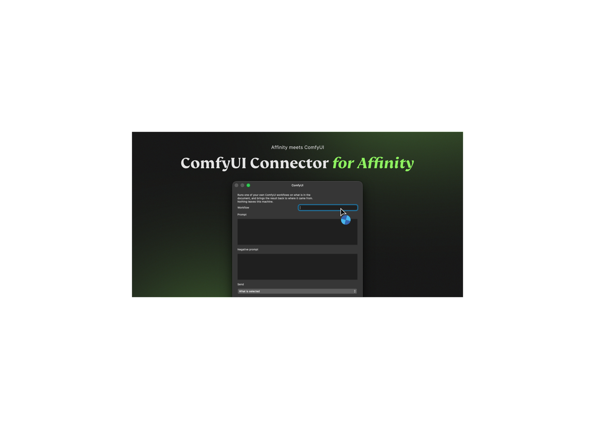

# ComfyUI for Connector for Affinity

Run your own [ComfyUI](https://www.comfy.org) workflows on artwork from Affinity. Connector for Affinity sends the chosen image to the ComfyUI instance you control, waits for its output, and can place the result back where the artwork came from. Nothing is sent to a third-party service.

## What you need

- **Connector for Affinity** installed and connected to Affinity.
- A running ComfyUI server — by default at `http://127.0.0.1:8188`.
- A local folder containing workflows saved in **Workflow → Export (API)** format.

The ordinary **Workflow → Save** format is not accepted by ComfyUI's API. Export the API form into the folder selected under the connector's settings.

## Install from the Marketplace

1. Open **Connector for Affinity**.
2. Choose **Browse** in the sidebar.
3. Search for **ComfyUI**.
4. Select it and press **Install**.
5. Open the connector's settings and set the **ComfyUI address** and **Workflows folder**.

The default address suits a ComfyUI instance started on the same computer. Use another local-network address only when your ComfyUI server runs elsewhere.

## Use it in Affinity

1. Choose an exported API workflow.
2. Add a prompt, or leave it empty to run the workflow exactly as it was saved.
3. Optionally provide a negative prompt and a seed.
4. Under **Send**, choose the selection, area, artboard, layer, spread, document, or a file when the workflow uses a `LoadImage` node.
5. Press **Run the workflow**.

When the workflow returns one image, Connector for Affinity can place it in the document automatically. For several results, it keeps them in the result view so you can choose what belongs on the canvas.

## Preparing a workflow

The connector reads the API graph and finds common nodes automatically:

- A positive text node receives the **Prompt**. Title a text node `prompt` in ComfyUI when you need to choose a specific one.
- A negative text node receives the **Negative prompt**. A title of `negative` takes priority.
- A `LoadImage` node receives the artwork selected in Affinity. Title a node `image` or `input` to choose a specific image node.
- A sampler seed receives the chosen seed, or a fresh random seed when it is left blank.
- A **Save Image** node is required for a generated image to come back.

After changing node titles or connections, export the workflow again with **Workflow → Export (API)**.

## Controls

| Control | What it changes |
| --- | --- |
| **Workflow** | Chooses one `.json` API workflow from the configured workflows folder. |
| **Prompt** | Replaces the workflow's positive text when one is supplied. |
| **Negative prompt** | Replaces the workflow's negative text when the graph has one. |
| **Send** | Exports and uploads Affinity artwork to a workflow image node, if that workflow uses one. |
| **Seed** | Uses a specific seed; leave it blank for a fresh random seed. |
| **Put the result back in the document** | Places a single completed image back into Affinity automatically. |
| **ComfyUI address** | Connector setting for the ComfyUI server, defaulting to `http://127.0.0.1:8188`. |
| **Workflows folder** | Connector setting for exported API workflow files. |

## Notes

- Connector for Affinity checks that ComfyUI is answering before it queues a workflow.
- It reports node-level workflow errors returned by ComfyUI where available.
- Temporary ComfyUI output is ignored; use a Save Image node for results intended to return to Affinity.
- Long workflows are supported for up to 30 minutes by default.

## Development

This connector consists of [`app.json`](app.json), which describes the settings and run form, and [`index.js`](index.js), which adapts an exported ComfyUI API graph and talks to the local server. Install it from the Marketplace for normal use; the files here are for review and development.
